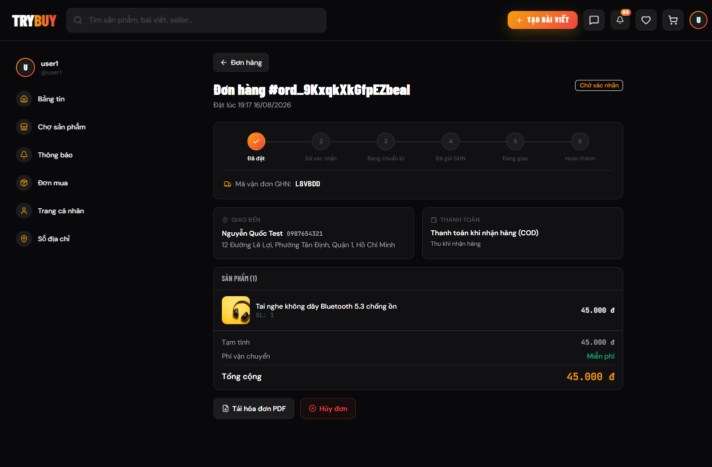
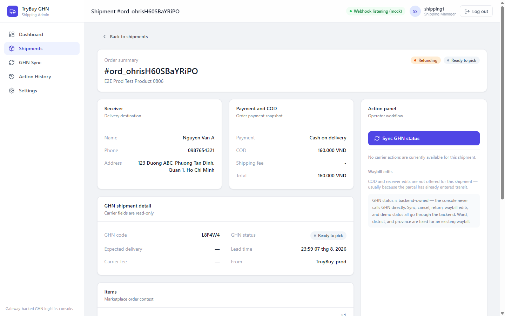
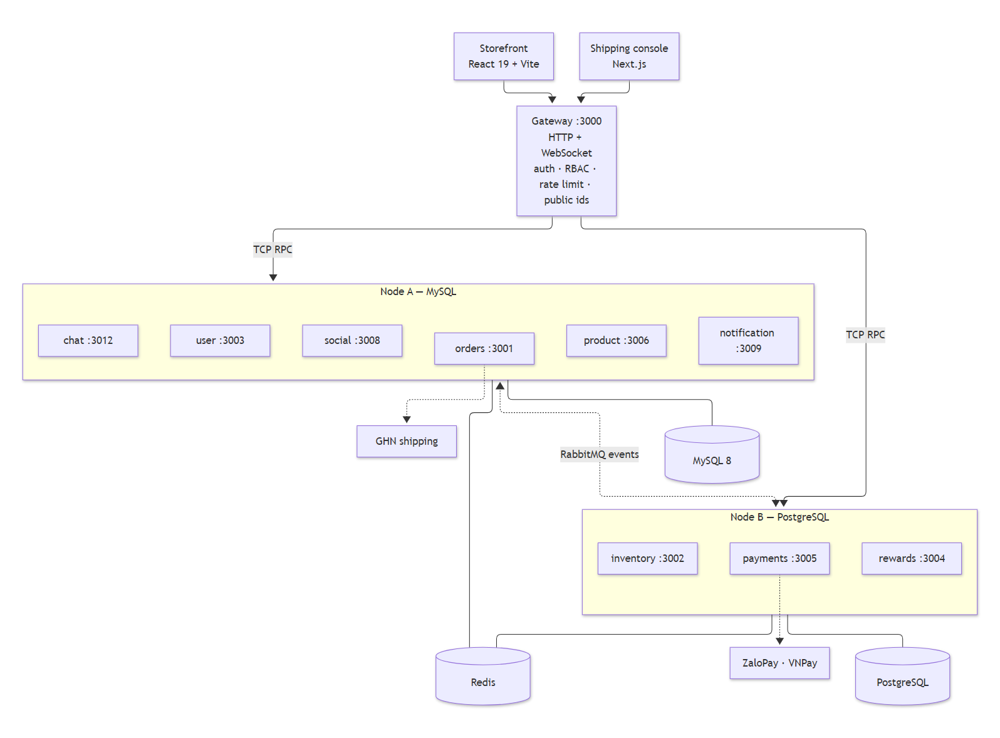
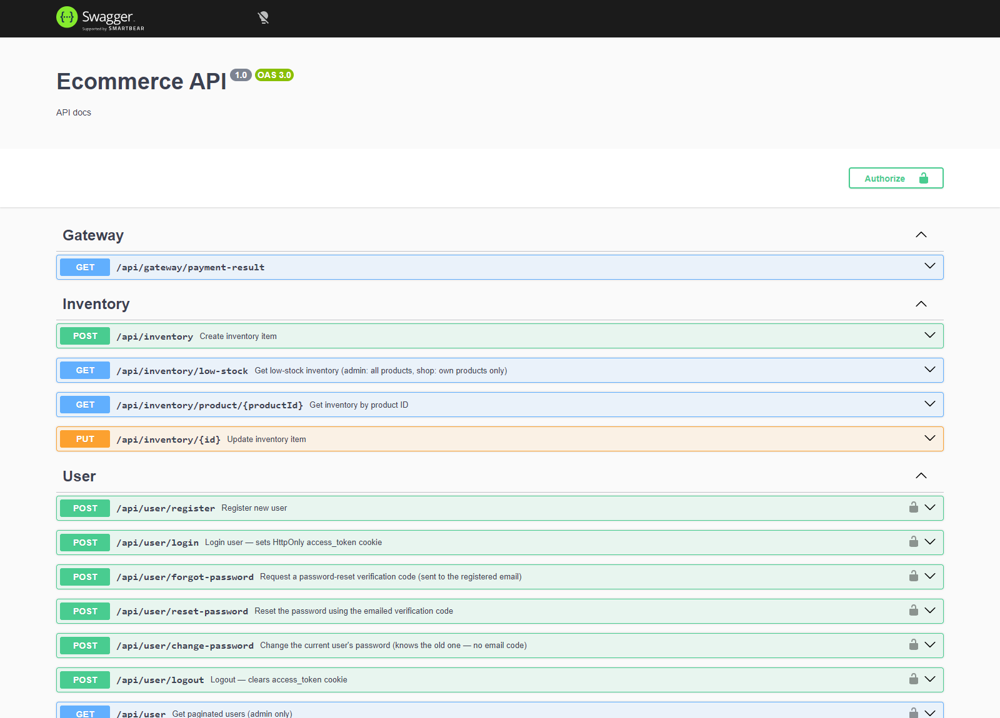
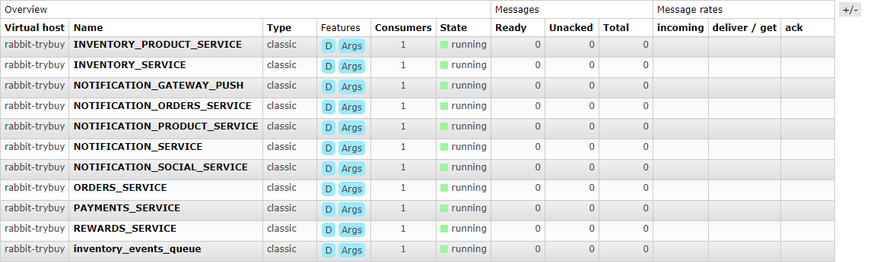
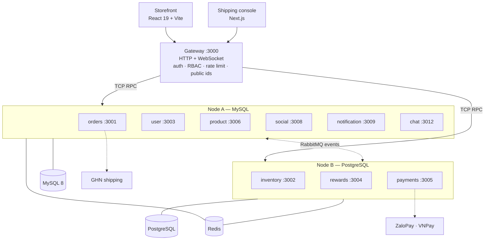

# TryBuy — Backend

[](https://github.com/quangtruong01234/BE-Microservice/actions/workflows/ci.yml)
[](./LICENSE)

Marketplace backend for TryBuy: a NestJS monorepo of **10 microservices** behind
a single HTTP gateway, talking over TCP RPC for commands and RabbitMQ for
integration events, on MySQL + PostgreSQL + Redis.

**Related repositories** —
[storefront (React + Vite)](https://github.com/quangtruong01234/FE-React-Vite) ·
[shipping console (Next.js)](https://github.com/quangtruong01234/web-flow-GHN)

Demo walkthrough and accounts: [`docs/DEMO.md`](./docs/DEMO.md).
Design rationale: [`docs/ARCHITECTURE.md`](./docs/ARCHITECTURE.md).

---

## Live demo

| | |
|---|---|
| **Storefront** | https://fe-react-vite.quangtruong01234.workers.dev |
| **Shipping console** | https://web-flow-ghn.vercel.app |
| **API docs** | `/doc` on the deployed gateway (Swagger) |

> ⏰ **The backend runs 14:00–19:00 ICT (UTC+7) only**, to keep hosting cost
> near zero. Both frontends stay online 24/7, but outside that window they
> cannot log in or load data. The screenshots below show each flow on the
> running system.

| Username | Role | Use it for |
|---|---|---|
| `demo.buyer` | `user` | Browse, cart, checkout, pay, track orders |
| `demo.seller` | `shop` | Manage own products, stock and incoming orders |
| `demo.seller2` | `shop` | Second shop — one cart splits into one order per shop |
| `demo.shipper` | `shipping_manager` | Shipping console: waybills, GHN sync, COD |
| `demo.admin` | `admin` | Role changes, moderation, platform vouchers |

All five accounts share one password, listed in [`docs/DEMO.md`](./docs/DEMO.md).
Demo data only; payments go through the VNPay / ZaloPay sandboxes — no real
money moves.

### Flow 1 — Buying (≈4 min · storefront · `demo.buyer`)

1. Browse the catalog without logging in. Search `ao thun` — it finds *áo thun*.
   Product URLs read `prod_…`, never a database id.
2. Log in and add items from two different shops to the cart.
3. Check out, optionally with a voucher. The cart splits into one order per
   shop; stock is reserved, not decremented.
4. Pay through the VNPay or ZaloPay sandbox (or COD). The order becomes `PAID`
   when the signed webhook lands, not when the browser returns.
5. Track the order. The status stepper and in-app notifications update in real
   time over Socket.IO as the seller and carrier act.

| Checkout | Order detail |
|---|---|
|  |  |
| Address, payment method (ZaloPay · VNPay · COD), order total | Opaque id `ord_…`, status stepper, GHN waybill code |

### Flow 2 — Selling (≈3 min · storefront · `demo.seller`)

1. Log in as the seller and open **Orders**. Only this shop's items are
   visible — the buyer's order from the other shop is not.
2. Unpaid online orders are blocked: they cannot be confirmed until payment
   lands. COD orders are exempt, since cash is collected on delivery.
3. Confirm the order. The status moves to *Confirmed* and the buyer is notified
   immediately.
4. Mark it ready to ship. The GHN waybill is handed to the carrier and the order
   appears in the shipping console.

| Seller queue | After confirming |
|---|---|
|  |  |
| Unpaid order blocked, COD order ready to confirm | The next action is "ready to ship" |

### Flow 3 — Shipping (≈3 min · shipping console · `demo.shipper`)

1. Log in to the console. A `user` account is refused — the console is
   role-gated, not merely hidden.
2. Open **GHN Sync** and press **Sync** on an order. The console never calls GHN
   directly; the backend pulls the status and records who synced and how.
3. Open the shipment detail: receiver, payment and COD amount, read-only carrier
   fields, and the webhook/sync timeline. *Update COD* is offered only while the
   parcel has not entered transit.
4. Switch back to the storefront as the buyer: the new status and its
   notification are already there.

| GHN Sync | Shipment detail |
|---|---|
|  |  |
| Pending count, per-order sync, last-synced time | Payment & COD, read-only carrier fields, action panel |

### What to look at

- **Press "Pay" twice.** Submit twice, or let the webhook arrive twice — the
  order is charged once. Every consumer is idempotent on the order id, because
  at-least-once delivery makes redelivery normal.
- **Race the last unit.** Check out the final item of a SKU in two browsers at
  once. One succeeds, the other gets a clean "out of stock" — never a negative
  stock row.
- **The ids in the URL.** `ord_…`, `prod_…`, `usr_…`. Internal numeric keys
  never leave the gateway, so ids cannot be enumerated; ownership is still
  checked after the id resolves.
- **The payment webhook.** Replay it with a tampered signature (the route is in
  Swagger) and it is rejected. Order state changes on the signed callback, never
  on the browser redirect.
- **A role change mid-session.** As `demo.admin`, promote `demo.buyer` to
  `shop`. The role lives in the JWT, so it takes effect on next login;
  `GET /api/user/me` surfaces the drift so the UI can prompt a re-login.

Screenshots use demo data only; names, phone numbers and addresses are
fictional.

---

## Screenshots

| Architecture | Swagger UI | RabbitMQ queues |
|---|---|---|
|  |  |  |

See [`docs/img/README.md`](./docs/img/README.md) for what each image should
show and the size budget.

## Architecture



| Service | Port | DB | Responsibility |
|---|---:|---|---|
| gateway | 3000 | — | Only HTTP-facing process: auth, RBAC, validation, rate limiting, public-id translation, WebSocket |
| orders | 3001 | MySQL | Cart, orders, lifecycle, returns, vouchers, shipping history, outbox |
| user | 3003 | MySQL | Accounts, roles and permissions, addresses, password reset |
| product | 3006 | MySQL | Catalog, SKU matrix, brands, categories, reviews, wishlist |
| social | 3008 | MySQL | Posts, comments, likes, follows, reports |
| notification | 3009 | MySQL | In-app notifications and transactional mail (no HTTP listener) |
| chat | 3012 | MySQL | Conversations and messages |
| inventory | 3002 | PostgreSQL | Stock levels and the reservation ledger |
| rewards | 3004 | PostgreSQL | Reward points |
| payments | 3005 | PostgreSQL | Payment records, ZaloPay and VNPay integration |

Shared libraries: `@app/common` (RabbitMQ, filters, resilience), `@app/cached`
(Redis), `@app/database` (TypeORM factories), `@app/constant` (ports, message
patterns, service names).

## Key engineering decisions

- **TCP RPC between services, not HTTP.** Internal calls are point-to-point
  commands, not resources — they need no URLs, verbs, status codes or JSON
  negotiation. NestJS message patterns are type-checked at both ends, and the
  transport cost is a fraction of HTTP's. Every client is registered with a
  custom `ResilientClientTCP` that republishes an unsent packet after a
  reconnect and fails fast on a dead socket, because the default client turned a
  dropped connection into a ten-second stall and then a 502.

- **RabbitMQ only for post-commit events.** The rule is mechanical: if the HTTP
  response depends on the answer, it is TCP; if it does not, it is an event.
  Checkout blocks on a stock check; it does not block on the rewards service
  crediting points. Hybrid beats "everything async" here because the alternative
  is reimplementing request/response on top of a queue.

- **Opaque public identifiers.** Databases and internal contracts keep numeric
  keys — efficient joins, cheap indexes. HTTP and WebSocket never see them.
  Clients get `usr_…`, `ord_…`, `prod_…`, `post_…`, `cmt_…`, translated at the
  gateway boundary. Sequential ids leak volume and invite enumeration; opaque
  ids do not. They are not authorization — ownership is still checked after
  resolving the id — but they stop a failed lookup from being a discovery tool.

- **Stock reservations instead of a decrement.** Checkout does not subtract
  stock; it writes a reservation row keyed by a UUID. Completion consumes it,
  cancellation releases it, an approved return moves it to `RETURNED`. Every
  transition is idempotent on that key, so a redelivered RabbitMQ message is a
  no-op rather than a double-decrement — which matters because at-least-once
  delivery means redelivery is normal, not exceptional.

- **Transactional outbox for the one event that cannot be lost.**
  `order_created` is inserted into an outbox table *inside the order's own
  transaction*, then published. A broker outage leaves the row pending and a
  poller drains it. Before this existed, a RabbitMQ blip produced live orders
  that nothing downstream ever heard about. Only that event is durable — the
  rest are best-effort by design, and saying so is cheaper than pretending
  otherwise.

- **Caching the final exposed payload, not the query.** The two public product
  reads are user-invariant, so the gateway caches the fully-serialized response
  (public ids already applied) in Redis for 10 seconds. That collapses a product
  TCP call, a user-enrichment TCP call and serialization into one local `GET`,
  and moved the public catalog from 61 to 798 req/s on the measurement box —
  a 13× step. Database pool tuning alone could not get past 61: the free-tier
  connection ceiling is a structural wall that only caching crosses. On the
  production EC2 the same catalog read sustains **1,228 req/s** and product
  detail **2,867 req/s** at 500 concurrent connections, with zero 5xx across
  141,430 responses — numbers, conditions and the raw autocannon output in
  [`docs/METRICS.md`](./docs/METRICS.md).

## Getting started

**Prerequisites:** Node.js 22, Docker (Redis + RabbitMQ), and a MySQL 8 and a
PostgreSQL database.

```bash
git clone https://github.com/quangtruong01234/BE-Microservice.git
cd BE-Microservice
npm ci

cp .env.example .env          # fill in DB credentials and secrets
docker compose up -d          # Redis :6379, RabbitMQ :5672 / :15672
```

Run the two node groups in separate terminals:

```bash
npm run start:nodeA    # gateway, orders, user, product, social, notification, chat
npm run start:nodeB    # inventory, payments, rewards
```

Swagger is then at <http://localhost:3000/doc>, and `GET /health` reports
per-dependency status.

Individual services (`npm run start:gateway`, `start:orders`, …) run on their
own in watch mode. Schema changes are explicit SQL migrations, never TypeORM
`synchronize`:

```bash
npm run db:migrate:status     # what is applied where
npm run db:migrate:dry-run    # print the SQL without running it
npm run db:migrate:nodeA      # apply pending MySQL migrations
npm run db:migrate:nodeB      # apply pending PostgreSQL migrations
node scripts/seed/seed-products.mjs
```

Demo accounts and a guided walkthrough are in [`docs/DEMO.md`](./docs/DEMO.md).

## Testing

```bash
npm test                  # unit suite (Jest)
npm run test:cov          # with coverage
npm run lint:check        # eslint, no autofix
npx tsc --noEmit          # typecheck
npm run check:conventions # project invariants eslint cannot express
bash scripts/metrics.sh --all   # regenerate every number quoted in the docs
```

**47 suites / 500 tests, all passing** at the commit recorded in
[`docs/METRICS.md`](./docs/METRICS.md) — counted by `scripts/metrics.sh`, not
by hand.

These are unit tests. There is no end-to-end suite: a real one needs live Redis,
RabbitMQ and both databases inside CI, which this project's free-tier
constraint rules out. Seven empty e2e scaffolds were deleted rather than left to
imply coverage that did not exist; endpoints are verified instead by scripted
`curl` runs against a live stack, recorded per change in
`ai-docs/agent-handoff/CHANGELOG.md`.

`check:conventions` deserves a word. It enforces three things a linter cannot
express — every TCP client uses the resilient class, a message pattern has the
same shape on both sides, and every microservice controller converts HTTP
exceptions to RPC ones. Each of those was a real 500 or 502 in this codebase
before it was mechanized.

## Deployment

GitHub Actions, two workflows:

- **CI** (on every push and PR): whitespace check → format → lint → typecheck →
  convention checks → **a guard that fails the build if the production hostname
  appears anywhere in the repo** → unit tests → build → pm2 config validation →
  `docker compose config` → production dependency audit.
- **Deploy** (on a green CI run against `main`): applies pending migrations on
  the instance, then restarts pm2. Under `set -e`, so a failed step rolls the
  instance back to the previous commit.

Production is a single EC2 instance running both node groups under pm2 from a
compiled `dist/`, with nginx terminating TLS in front. The two frontends deploy
independently, so any contract change is classified before it ships: additive
changes go out alone, breaking ones are held until every repo is ready.

**The backend runs 14:00–19:00 ICT only** — it is a portfolio deployment on
free-tier infrastructure, not a 24/7 service. The storefront and console stay
up, but outside that window they cannot load data.

## How AI is used in this project

This backend was built with an AI coding agent in the loop, and the repository
is set up to make that work rather than to hide it.

- Specs come first. Architecture, conventions and domain rules are written as
  documents in `ai-docs/agent-context/`, and the agent implements against them.
- I review every change. The agent proposes a diff; merging is my decision.
- Tests and static checks are the gate, not a formality. `tsc --noEmit`,
  eslint, the convention checker and the unit suite all run in CI, and nothing
  merges red.
- Decisions and their residual consequences are written down as they are made —
  58 documented behaviours in `ai-docs/agent-context/known-behaviors.md`, each
  recording what was chosen and what it costs, so neither I nor the agent
  re-litigates a settled question six weeks later.
- The parts that need judgement — where the service boundaries fall, which
  transport a call uses, what happens when the broker is down — are mine. The
  agent is fast at writing the code that follows from those calls, and
  unreliable at making them.

Start with [`docs/ARCHITECTURE.md`](./docs/ARCHITECTURE.md) for the design and
[`AGENTS.md`](./AGENTS.md) for the working rules.

## Project structure

```
.
├── apps/                      # 10 microservices, one folder each
│   ├── gateway/               # the only HTTP/WebSocket process
│   ├── orders/                # cart, orders, returns, vouchers, outbox
│   ├── user/ product/ social/ notification/ chat/     # Node A, MySQL
│   └── inventory/ payments/ rewards/                  # Node B, PostgreSQL
├── libs/
│   ├── common/                # RabbitMQ, filters, TCP resilience
│   ├── cached/                # Redis module
│   ├── database/              # TypeORM module factories
│   └── constant/              # ports, message patterns, service names
├── database/migrations/       # explicit SQL, applied by the deploy
├── docs/                      # architecture, metrics, demo, deployment
├── scripts/                   # migrations, seed, load tests, metrics, checks
├── ai-docs/                   # specs and decision records the agent works from
├── .github/workflows/         # CI and Deploy
├── docker-compose.yml         # Redis + RabbitMQ for local development
└── ecosystem.config.js        # pm2 process layout for production
```

## License

MIT — see [LICENSE](./LICENSE).
