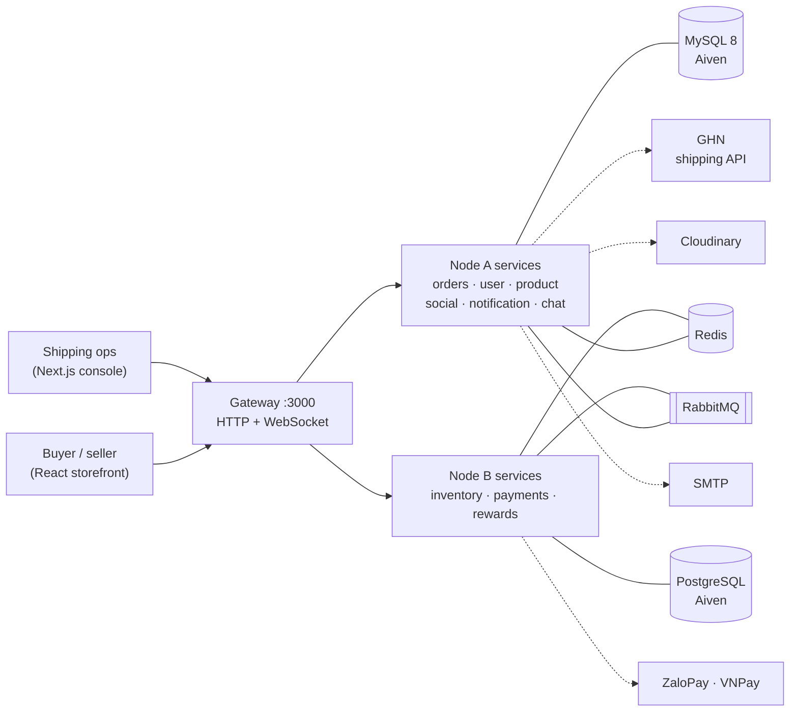
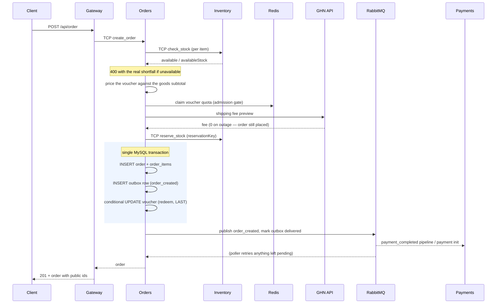
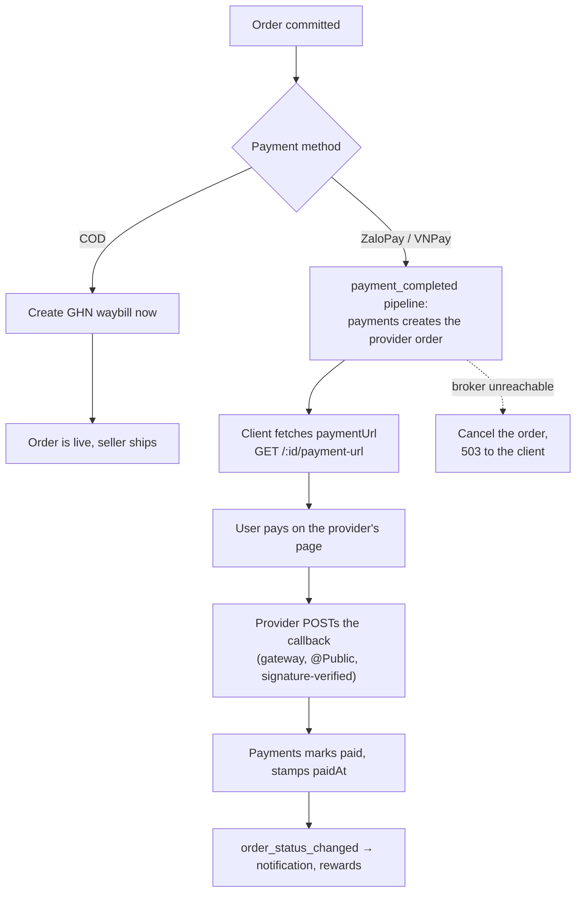
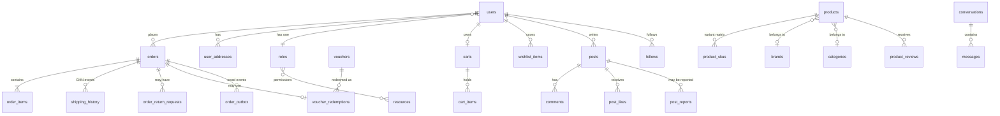
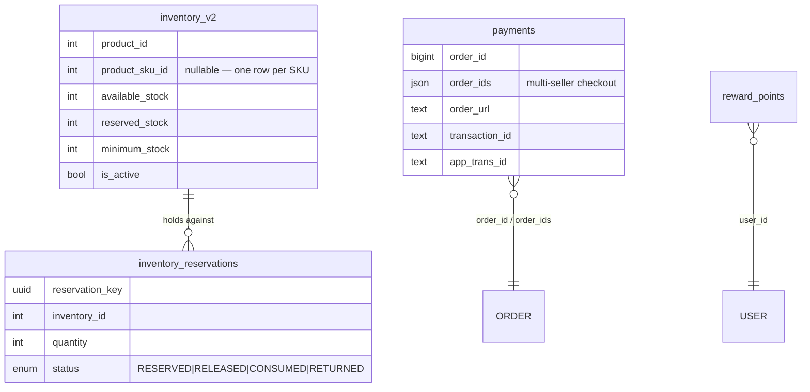
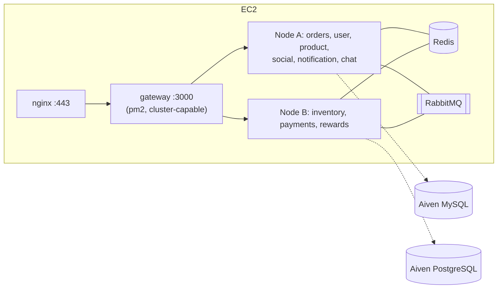

# Architecture

TryBuy is a marketplace backend built as a NestJS monorepo: **10 microservices
and 4 shared libraries**, with exactly one HTTP-facing process. This document
explains how the pieces fit together and — more usefully — *why* each boundary
sits where it does.

- [System context](#system-context)
- [Service boundaries](#service-boundaries)
- [Communication: TCP vs RabbitMQ](#communication-tcp-vs-rabbitmq)
- [Checkout, end to end](#checkout-end-to-end)
- [Payment and webhook flow](#payment-and-webhook-flow)
- [Data model](#data-model)
- [Consistency strategy](#consistency-strategy)
- [Caching](#caching)
- [Security](#security)
- [Deployment topology](#deployment-topology)

---

## System context

Two clients talk to one gateway. Everything behind the gateway is TCP-only and
unreachable from outside the host — there is no second way in, so
authentication, rate limiting, validation and response shaping all have exactly
one place to live.

## Service boundaries

| Service | Port | Database | Owns |
|---|---:|---|---|
| **gateway** | 3000 | — | HTTP + WebSocket edge: auth, RBAC, validation, rate limiting, response shaping, public-id translation |
| **orders** | 3001 | MySQL | Cart, orders, order lifecycle, returns, vouchers, shipping history, outbox |
| **user** | 3003 | MySQL | Accounts, roles/permissions, addresses, password reset |
| **product** | 3006 | MySQL | Catalog, SKU matrix, brands, categories, reviews, wishlist |
| **social** | 3008 | MySQL | Posts, comments, likes, follows, reports |
| **notification** | 3009 | MySQL | In-app notifications + transactional mail (no HTTP listener at all) |
| **chat** | 3012 | MySQL | Conversations and messages |
| **inventory** | 3002 | PostgreSQL | Stock levels and the reservation ledger |
| **payments** | 3005 | PostgreSQL | Payment records, ZaloPay/VNPay integration |
| **rewards** | 3004 | PostgreSQL | Reward points |

Shared libraries: `@app/common` (RabbitMQ, filters, resilience, shared
constants), `@app/cached` (Redis), `@app/database` (TypeORM module factories),
`@app/constant` (ports, message patterns, service names).

**Why two databases.** The split is not decorative. Orders, users, products and
social data are relational-read-heavy and live together in MySQL. Inventory,
payments and rewards are the three domains where a write must be *correct under
concurrency* — stock holds, money, point balances — and they live in PostgreSQL,
whose row-level locking and `RETURNING` semantics the reservation ledger depends
on. Cross-injecting a repository across that line is forbidden; the only way
from one side to the other is a message.

**Why the gateway owns identity translation.** Internal ids are auto-increment
integers, which are convenient joins and terrible public identifiers — they leak
volume and invite enumeration. Every entity exposed over HTTP also carries an
opaque `publicId` (`usr_…`, `ord_…`, `prod_…`, `post_…`, `cmt_…`), and the
gateway translates in both directions at the boundary. Services keep working in
integers and never learn that public ids exist.

## Communication: TCP vs RabbitMQ

Both transports are in use, deliberately, and the rule for picking one is
mechanical:

| | TCP RPC | RabbitMQ fanout |
|---|---|---|
| **Used for** | Commands and queries that need an answer now | Post-commit integration events |
| **Shape** | `client.send(PATTERN, payload)` ↔ `@MessagePattern` | `client.emit(EVENT, payload)` ↔ `@EventPattern` |
| **Caller** | Blocks, with an explicit timeout | Fire and forget |
| **Examples** | gateway reads, login, stock check / reserve / release / consume | `order_created`, `payment_completed`, `order_canceled`, `sku.upserted` |
| **Count today** | 153 handlers | 22 handlers |

The dividing question is *"does the HTTP response depend on this?"* Checkout
cannot answer the client until it knows whether stock is available, so the stock
check is TCP. Nobody's HTTP response depends on the rewards service crediting
points, so that is an event.

Two operational details that matter more than they look:

- **Every TCP client registration uses `customClass: ResilientClientTCP`**
  (`libs/common/src/resilience/`), never the stock `Transport.TCP`. It
  reconnects and republishes an unsent packet, fails immediately on an
  already-closed socket instead of hanging the caller for the full timeout, and
  enables TCP keep-alive. A dropped socket used to surface as a 10-second stall
  and then a 502.
- **Timeouts are constants, not literals.** `TCP_TIMEOUT_MS.READ` (5 s) for pure
  reads, `.WRITE` (10 s) for mutations and anything with an external API leg.

## Checkout, end to end

Checkout is the path where every architectural decision in this repo shows up at
once, so it is worth following in full.

Things worth pointing at:

- **Order of operations is a throughput decision, not a style one.** The voucher
  redemption is a conditional `UPDATE` that takes an exclusive row lock held
  until commit. On a hot promo code, every concurrent checkout queues behind that
  lock, so where the statement sits inside the transaction sets the endpoint's
  ceiling. It is the last statement before commit; it used to also span the
  order-item and outbox inserts, and that was measurably worse.
- **The Redis voucher quota is an admission gate, not the source of truth.** The
  database cap is still authoritative, but it only rejects the losers at the very
  end — after each has burnt an outbound GHN call and a stock reservation that
  then has to be compensated. The Redis counter turns that into a one-round-trip
  rejection. It fails **open**: if Redis is down, checkout proceeds and the DB cap
  does its job.
- **Compensation is explicit.** Everything after the reservation is inside a
  `try` whose `catch` releases the reservation and hands the voucher quota back.
  There is no distributed transaction — there is a reservation key and a
  compensating action for each step that can fail after it.
- **A failed publish does not mean a lost event** — see below.

## Payment and webhook flow

COD and online payment diverge right after the order commits.

The callbacks (`POST /zalopay/callback`, `POST|GET /vnpay/callback`) are the only
unauthenticated write endpoints in the system. They are `@Public()` because the
provider has no session, and they are safe because the payload signature is
verified with the shared secret before anything is trusted — the route
authenticates the *message*, not the caller.

The asymmetry in the diagram is deliberate. If the broker is unreachable, a COD
order is fine — the outbox poller will deliver `order_created` in 30 seconds and
nothing the user sees depends on it. An online order is not fine: the client asks
for `paymentUrl` immediately, and a poller retry half a minute later is useless.
So that one case cancels the order and returns 503 rather than handing back an
order that can never be paid.

## Data model

Two databases, no cross-database foreign keys. Relationships that span the line
are carried by id and reconciled by message.

### MySQL — Node A

### PostgreSQL — Node B

`inventory_reservations.status` is the whole concurrency story in one column.
Stock is not decremented at checkout; a reservation row is created. Completion
moves it to `CONSUMED`, cancellation to `RELEASED`, an approved return to
`RETURNED`. Every transition is idempotent on `reservationKey`, so a redelivered
message is a no-op rather than a double-decrement.

## Consistency strategy

There is no two-phase commit anywhere. Four mechanisms carry the load instead:

**1. Transactional outbox — for the one event that must not be lost.**
`order_created` is written to `order_outbox` *inside the same MySQL transaction
as the order*, then published immediately. If the broker is down, the publish
fails but the row stays `pending`, and a poller drains it later. Before this
existed, a broker outage produced live orders that nothing downstream ever heard
about. Only `order_created` is durable this way — every other publish is
best-effort by design, and that is a conscious scope decision rather than an
oversight.

**2. Reservations plus compensation — for stock.** Described above. The
reservation key is the idempotency key for every later transition.

**3. Optimistic locking — for concurrent edits.** `products.version` is bumped on
write; a stale `version` in a `PATCH` yields `409`. It is **opt-in**: a client
that sends no version gets last-write-wins, because forcing it on every caller
would break integrations that have no reason to care.

**4. Idempotent consumers.** Every `@EventPattern` handler keys on something
stable — `orderId`, `reservationKey`, or a unique constraint — because RabbitMQ
guarantees at-least-once delivery and a requeue is a normal event, not an error.
Handlers wrap their work in `try/catch` and choose their nack explicitly:
requeue for transient failures (DB blip, service restarting), no-requeue → dead
letter for data that will never become processable.

A deliberate non-goal: **a product `PATCH` is not atomic.** It can be up to three
writes across two databases (product row, SKU matrix, inventory fanout), and a
failure partway through means some of it landed. Making it atomic would require
distributed transactions across MySQL and PostgreSQL; the accepted cost is that
callers must not assume a failed `PATCH` changed nothing.

## Caching

Redis is used in three distinct ways, and conflating them would be a mistake:

| Use | TTL | Failure mode |
|---|---|---|
| Gateway full-response micro-cache on the two public product reads | 10 s | Warn and continue — a cache miss is a slow request, never a failed one |
| Service-level query caches (product list, search) | 5 s | Same |
| Voucher quota admission counter | per-voucher | Fails **open** |

The micro-cache is only safe because both cached routes are user-invariant: no
`req.user` influences the response, so the final exposed payload — public ids
already applied — can be handed to the next caller verbatim. It is what took the
public product list from 61 to 798 req/s (see [METRICS.md](./METRICS.md)).
Writes best-effort invalidate the affected keys, and the 10-second TTL bounds
staleness regardless of whether that invalidation succeeded.

## Security

- **JWT in an HttpOnly cookie.** The token never touches `localStorage`, so XSS
  cannot exfiltrate a session. All browser requests use `credentials: "include"`.
- **Guarded by default.** A global `JwtAuthGuard` protects every route; public
  routes opt out explicitly with `@Public()`. The failure mode of forgetting a
  decorator is therefore a locked endpoint, not an open one.
- **RBAC with resource-scoped permissions** — `@CheckPermission("product",
  "create:own")` vs `@CheckPermission("order", "read:any")` distinguishes acting
  on your own rows from acting on anyone's.
  Roles are baked into the JWT at login, which means a role change only takes
  effect on the target's next login; `GET /api/user/me` reports the drift so the
  frontend can prompt a re-login.
- **Rate limiting at the gateway**, per route per user/IP, backed by Redis.
- **Webhook authenticity is verified, not assumed** — payment callbacks check the
  provider signature; the GHN webhook takes a shared token, preferring a header
  over the legacy query parameter.
- **Errors are sanitised on the way out.** `HttpExceptionFilter` produces one
  envelope shape and never lets a raw driver error, stack trace or internal path
  reach the client. Microservices throw ordinary NestJS exceptions and
  `HttpToRpcExceptionFilter` converts them, so a `ForbiddenException` deep in a
  service still arrives at the client as `403` rather than being swallowed into a
  `500`.
- **No secrets in the repo.** Credentials, the production hostname and test
  accounts all live outside version control; committed files carry placeholders.

## Deployment topology

One EC2 instance runs both node groups under pm2, from a compiled `dist/`, with
nginx terminating TLS in front. Merging to `main` triggers the deploy.

Schema changes are explicit SQL migrations — production never runs TypeORM
`synchronize`. The deploy applies pending migrations on the instance *before*
restarting pm2, under `set -e`, and rolls back to the previous commit if any step
fails. That ordering is correct but has a sharp edge worth knowing: a database
that is merely unreachable aborts the run and reverts the code, so a green CI run
and a green push can still produce no release. Releases are verified with a
runtime probe against production, never by reading the git head.

Details — pm2 layout, nginx configuration, the migration ledger, environment
variables — are in [`deployment-runtime.md`](./deployment-runtime.md) and
`ai-docs/agent-context/ops-runtime.md`.
